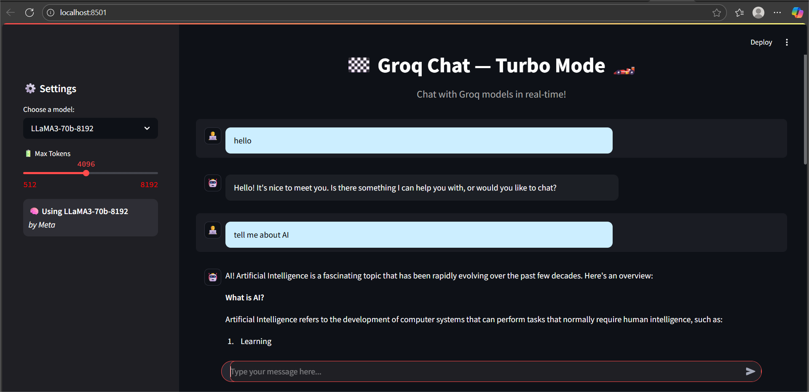

# Groq Chatbot

A simple and interactive chatbot built using **Streamlit** and **Groq API**.  
This project allows users to chat with AI models in real-time through a clean web interface.  
It demonstrates the use of APIs for AI-powered conversations and maintains chat history.  
Built for learning and showcasing AI integration in web apps.  
Perfect for beginners exploring Python web apps and AI APIs.  

## Deployed App
Try the live version here: [Groq Chatbot on Streamlit](https://groq-chatbot-cifsj9xacmwhpmsshcemvt.streamlit.app/)

## Tech Stack
- **Frontend:** Streamlit  
- **Backend / API:** Groq API, Python

